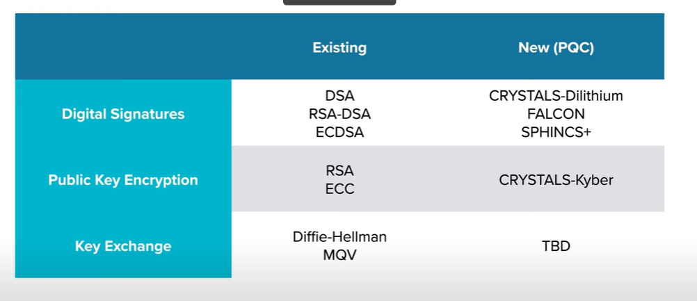

**AGENDA**

1. Quantum Computers
2. Quick Crypto Explainers
3. Quantum Algorithms
4. Quantum Progress
5. Crypto Standards
6. Market Demands
7. PETs
8. AI Data

1. Quantum Computers

    These are theoretically far better than classical computers at **SPECIFIC TYPES** of mathematical problems
    Ex: Modelling systems, probabilatic systems
    The security of some modern cryptography relies on some **HARD PROBLEMS THAT QUANTUM MAKES EASY**

    **SHARED SECRET CRYPTOGRAPHY** aka **SYMMETRIC CRYPTOGRAPHY**

        1. 99.9% of the time this is used for data encryption at REST and in transit.
        2. Same key encrypts and decrypt the data
        3. Very fast and efficient and ofter hardware accelerated 
        4. Typically algorithmically scramble; not mathematically transformed

        Ex: House 
            Key of house X is the owner:A, B, C has copy of key can unlock
                                        if A creates a new copy of the key then ?
                                        X again creates new key and share to B, C
                                        Now A cannot access
                                        which means : whenever the key is shared, re encrypt the data using new key.
            
        SHARED SECRET CRYPTOGRAPHY used to secure own stuff servers, phone etc.
        Also to actually encrypt the data when keys have been securely shared between parties.
        Most used Algo: Advanced Encryption Standard (AES)
                    
    **PUBLIC KEY CRYPTOGRAPHY** aka **ASYMMETRIC CRYPTOGRAPHY**

        1. 99.9% this is how we agree upon sharing symmetric keys
        2. Also used for signing
        3. One key (public) encrypts another key (private) decrypt data
        4. Relatively slow specially on bigger chunk of data

        Ex: House 
            One key to lock another to unlock
        
        Public key cryptography used in communications and to secure data that is shared, but really just used to share one or more secrets that actually protect the data in question.
        Most used Algo: Elliptic Curve Cryptography & RSA

        
        ===============================================================================================================================                
    **QUANTUM COMPUTERS THREATENS ALMOST ALL OUR EXISTING CRYPTOGRAPHY INCLUDING BOTH PUBLIC KEY AND SYMMETRIC**

    =============================================================================================================

    **Two Algorithms that may easily attack cryptography**
 
    1. **SHOR's Algorithm** (Time to break a key from billions of years to weeks or less )
                            Completely breaks RSA, Finite field DH, ECC DH algortihms (Public key all broken by shor algorithm)
                            Current Public record for factoring a number using shor's algorithm : 261980999226229 
    2. **Grover's Algorithm** (Time to break a key from many billions of years fewer billions of years )
                                Weakens the security of AES

        =============================================================================================================

    **NIST set the standards**
    In 2016, concerned about quantum computers, NIST launched the Post Quantum Competition (PQC) to develop and standardize the next generation of public key algorithms that is secure from both classical and quantum computer attacks.

    4 Winner selected last year:

    1. 